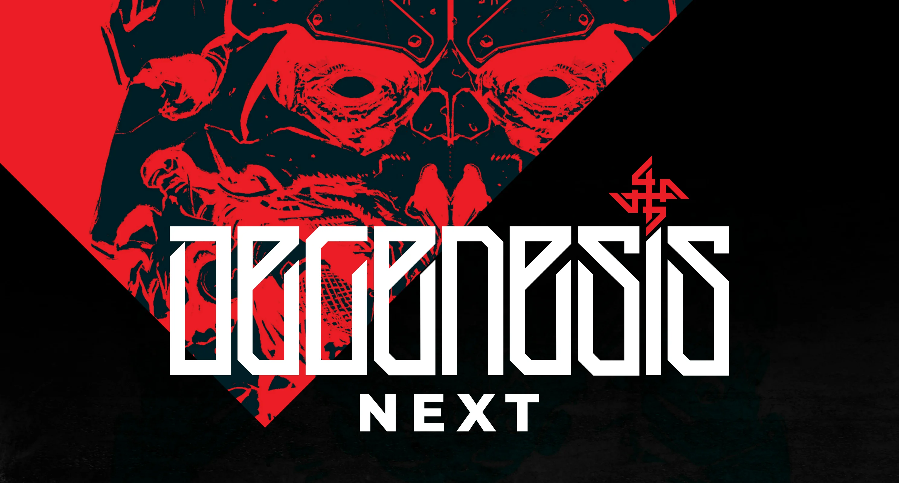

[](https://discord.com/invite/MC6gEVvnzm)

An unoffical, community-supported system for playing [Degenesis](https://degenesis.com/) on [Foundry VTT](http://foundryvtt.com/).

Degenesis® is ™ SIXMOREVODKA Studio GmbH. All rights reserved. This module contains information and graphics from Katharsys that have been used with permission from the publisher. All used content from the handbook belong to the respective authors.

## Work in progress disclaimer

This release represents an extremely early alpha version, in which approximately 80% of features are either not yet implemented or do not function correctly. It is intended solely for preliminary testing and gathering feedback.

## About NEXT

Although the system is based on the original foundry implementation, a lot of things related to the data structures of actors or objects have changed, so the systems are not compatible. Writing migration scripts with such large changes, requires a lot of work (including testing all critical cases) and spare time.

## Supporters

**Cameron**

## Special Thanks

WIP

## System.json manifest (not working yet)

    https://github.com/greedyj4ck/degenesis-next-foundryvtt/releases/latest/download/system.json

## Developer Installation

- Git clone the repo.
- Run inside terminal in main folder:

```bash
npm install
```

Project is beeing bundled by Vite.

- Run:

```bash
npm run watch
```

## Credits

**Degenesis-Next** is based on original work of following authors:

- MooMan
- Darkhan
- ClemEvilzz
- KristjanLaane
- Greedyj4ck

**Code and UI authors:**

- Greedyj4ck
- Calion

**Item packs icons:**

- Renart de Maupertuis (Renart de Maupertuis#1302)
- Pablo Ruiz Valls (Pabruva#1968)
- Greedyj4ck (GЯΣΣDYJΛCK#2690)
- Calion (calion16)

**Translations:**

- Meldinov
- Herugrim (Herugrim#3880)
- Pablo Ruiz Valls (Pabruva#1968)
- Hozon - Nico (Hozon#7832)
- Calion (calion16)
- Dentatum (.dentatum)
- diskordanz (diskordanz)

> If you have worked on or contributed to the translation of the system and you are not on the list - please write a message.

## Artwork

Default world background **Potentials** by **Claudiu-Antoniu Magherusan** https://www.artstation.com/artwork/PmA5aB  
Github banner **Homo Degenesis** by **Marko Djurdjevic** https://www.sixmorevodka.com/  
Skull from THE JACKAL'S PROPHECY https://www.youtube.com/watch?v=6y1kQFN5zB0

###### COMPENDIUM BANNERS

- various illustrations from Degenesis books https://www.degenesis.com
- concept by **Wiliam Bao** https://www.sixmorevodka.com/not-so-famous-work/degenesis-concept/#&gid=1&pid=277
- concept by **Marko Djurdjevic, Timo Mimus, Jelena Kevic-Djurdjevic** https://www.sixmorevodka.com/not-so-famous-work/degenesis-concept/#&gid=1&pid=161
- **Legacies** by **Claudiu-Antoniu Magherusan** https://www.sixmorevodka.com/not-so-famous-work/degenesis/#&gid=1&pid=152
- **Bassham map** from https://degenesis.com/downloads/maps
- **2^16** from https://degenesis.com/world/stories/chroniclers/2-16
- **Unreleased dice picture** from official Degenesis Twitter account
